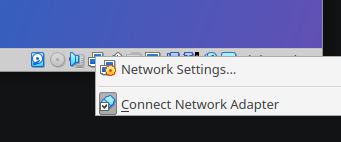
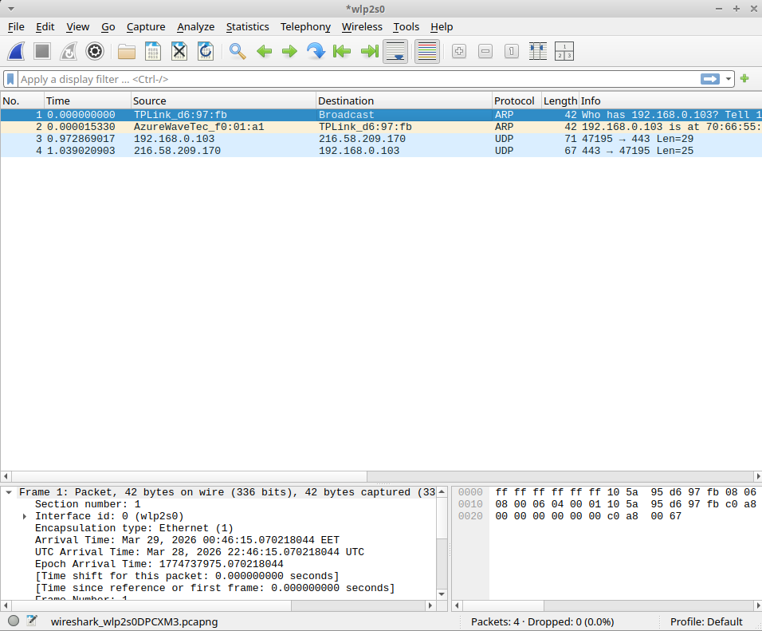
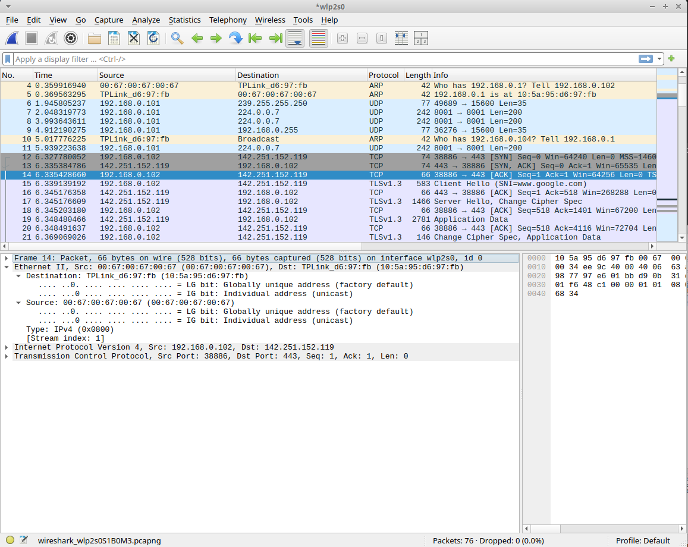

> x) Lue ja tiivistä. (Tässä x-alakohdassa ei tarvitse tehdä testejä tietokoneella, vain lukeminen tai kuunteleminen ja tiivistelmä riittää. Tiivistämiseen riittää muutama ranskalainen viiva.)
>- Karvinen 2025: Wireshark - Getting Started
>- Karvinen 2025: Network Interface Names on Linux

Wireshark on verkon analysointityökalu. Sen avulla voi analysoida lähetettyjä ja vastaanotettuja TCP/IP, UDP, ARP, yms. paketteja ja bluetooth paketteja.

"***The start of the name, prefix, identifies the type***

***Prefix	Interface type***

***en	Wired Ethernet***

***wl	WLAN, wireless local area network, WiFi***

***lo	Loopback adapter.***

> a) Linux. Asenna Debian tai Kali Linux virtuaalikoneeseen. (Tätä alakohtaa ei poikkeuksellisesti tarvitse raportoida, jos sinulla ei ole mitään ongelmia. Jos on mitään haasteita, tee täsmällinen raportti)

Suosittelen asentamaan virtualboxiin guest additions lisäosan, jotta virtuaalikoneessa toimii resize, tiedostojen kopiointi ja jaettu leikepöytä.

> b) Ei voi kalastaa. Osoita, että pystyt katkaisemaan ja palauttamaan virtuaalikoneen Internet-yhteyden.

Testaan että netti toimii:

`┌──(kali㉿kali)-[~]`

`└─$ ping 8.8.8.8`

`PING 8.8.8.8 (8.8.8.8) 56(84) bytes of data.`

`64 bytes from 8.8.8.8: icmp_seq=1 ttl=255 time=11.3 ms`

`64 bytes from 8.8.8.8: icmp_seq=2 ttl=255 time=4.57 ms`

`64 bytes from 8.8.8.8: icmp_seq=3 ttl=255 time=3.70 ms`

`^C`

`--- 8.8.8.8 ping statistics ---`

`3 packets transmitted, 3 received, 0% packet loss, time 2003ms`

`rtt min/avg/max/mdev = 3.700/6.512/11.266/3.380 ms`

Virtualboxista voi ottaa internetin pois klikkaamalla hiiren oikealla tietokoneen kuvasta ja ottaa pois "connect network adapter

testataan että netti ei toimi:

┌──(kali㉿kali)-[~]

└─$ ping 8.8.8.8

ping: connect: Network is unreachable'

Eli siis ei tule myöskään packet loss, sanoo suoraan ettei verkko ole käytössä.

> c) Wireshark. Asenna Wireshark. Sieppaa liikennettä Wiresharkilla. (Vain omaa liikennettäsi. Voit käyttää tähän esimerkiksi virtuaalikonetta).

sudo apt update && sudo apt install wireshark

sudo wireshark

graafisesta näkymästä valitaan oma verkkokortti ja sitten pääsee analysoimaan

> d) Oikeesti TCP/IP. Osoita TCP/IP-mallin neljä kerrosta yhdestä siepatusta paketista. Voit selityksen tueksi laatikoida ne ruutukaappauksesta. (Voit käyttää vastauksesi osana ruutukaappaustasi h0-tehtävästä, mutta tässä tehtävässä tarvitaan myös sanallinen selitys.)

Sattumalta ei ollut yhtään TCP/IP pakettia, joten uudelleen analysoimaan.

Yritin google chromella saada tcp/ip pakettia menemällä google.com osoitteeseen, mutta sain vaan ARP, DNS, UDP ja QUIC paketteja wiresharkiin. En saanut tcp/ip pakettia.

Mutta vastaus tuli googlesta miksi ei tullut tcp/ip pakettia:

***QUIC (/kwɪk/) is a general-purpose transport layer network protocol initially designed by Jim Roskind at Google.[1][2][3] It was first implemented and deployed in 2012[4] and was publicly announced in 2013 as experimentation broadened. It was also described at an IETF meeting.[5][6][7][8] QUIC is supported by major web browsers, including Chrome,[9] Edge,[10][11] Firefox,[12] and Safari.[13] In Chrome, QUIC is used by more than half of all connections to Google's servers.[9]***

-- lähde: wikipedia

Mutta tein sitten niin että bash terminaalissa laitoin komennon:

`curl https://www.google.com/`

Sitten tuli TCP/IP paketti.

Eli siis paketissa on ensin ethernet protokollan versio 2

--> paketin source ja destination

--> mun koneen mac on 00:67:00:67:00:67 ja reitittimen mac osoite (gateway) on 10:5a:95:d6:97:fb

sen jälkeen tulee IP protokolla versio 4 kerros

--> Eli siin on mun koneen IP osoite ja sitten on googlen ip osoite (tuolla pitäisi olla dns paketti aiemmin jossa haetaan googlen ip mutta ehkä se on välimuistitettu mun koneessa niin sen takia ei ole pakettia)

Ja sen jälkeen on vielä TCP data

--> Eli siinä kerrotaan että mun kone portti 38886 on source ja googlen palvimen portti on 443 (https)

Tässä voi hyödyntää sitä OSI -mallia

> e) Mitäs tuli surffattua? Avaa surfing-secure.pcap. Tutustu siihen pintapuolisesti ja kuvaile, millainen kaappaus on kyseessä. Tässä siis vain lyhyesti ja yleisellä tasolla. Voit esimerkiksi vilkaista, montako konetta näkyy, mitä protokollia pistää silmään. Määrästä voit arvioida esimerkiksi pakettien lukumäärää, kaappauksen kokoa ja kestoa.

Tässä on siis kyseessä verkkoliikenteen kaappaus.

Käyttäjä on siis selaimellaan mennyt googleen ja terokarvinen.com ja jne

> f) Vapaaehtoinen, vaikea: Mitä selainta käyttäjä käyttää? surfing-secure.pcap (Päivitys 2025-03-31 w14 ma - muutin tehtävän vapaaehtoiseksi Giang:n suosituksesta)

Yritin aluksi katsoa jos olisi HTTP dataa (ei salattua https) joukossa, koska HTTP headereissa näkyy user agent, mutta sellaista en löytänyt. Kuitenkin QUIC protokollaa ollaan käytetty, joten selain on luultavasti joku yleisimmistä nettiselaimista: chrome, firefox, edge, safari jne. ***QUIC is supported by major web browsers*** niinkuin sanoin aiemmin.

> g) Minkä merkkinen verkkokortti käyttäjällä on? surfing-secure.pcap

Frame 1: Packet, 74 bytes on wire (592 bits), 74 bytes captured (592 bits)
Ethernet II, Src: 52:54:00:2f:e1:e5 (52:54:00:2f:e1:e5), Dst: 52:54:00:cc:d7:12 (52:54:00:cc:d7:12)
    Destination: 52:54:00:cc:d7:12 (52:54:00:cc:d7:12)
    Source: 52:54:00:2f:e1:e5 (52:54:00:2f:e1:e5)
    Type: IPv4 (0x0800)
    [Stream index: 0]
Internet Protocol Version 4, Src: 192.168.122.7, Dst: 192.168.122.1
User Datagram Protocol, Src Port: 46428, Dst Port: 53
Domain Name System (query)
    Transaction ID: 0x4a75
    Flags: 0x0100 Standard query
    Questions: 1
    Answer RRs: 0
    Authority RRs: 0
    Additional RRs: 0
    Queries
    [Response In: 4]

Eli siis 52:54:00:2f:e1:e5 on käyttäjän verkkokortti

Esimerkiksi https://maclookup.app/ sivulta voi katsoa verkkokortin merkin.

Realtek (UpTech? also reported)

Eli joko realtek tai uptech

> h) Millä weppipalvelimella käyttäjä on surffaillut? surfing-secure.pcap
>- Huonoja uutisia: yhteys on suojattu TLS-salauksella.

Yhteydet ovat suojattu, joten surffausdataa en pääse katsomaan. Ja miten niin huono juttu, on hyvä asia että on salattu. Salaus varmistaa turvallisen netin käytön, kukaan ei voi seurata liikennettäsi ja estää man in the middle hyökkäykset TLS varmenteiden/ssl sertifikaattien takia. Kuitenkin, voi olla että RSA salaus tullaan murtamaan myöhemmin kvanttitietokoneilla.

Kuitenkin, sitä salaus ei estä että en näkisi mihin paketti on matkalla. Koska paketin pitää tietää minne se lähetetään.

Mihin sivuihin käyttäjä on mennyt:

www.google.com

terokarvinen.com

gc.zgo.at

commentero.terokarvinen.com

goatcounter.netlify.org

terokarvinen.goatcounter.com

> i) Analyysi. Sieppaa pieni määrä omaa liikennettäsi. Analysoi se, eli selitä mahdollisimman perusteellisesti, mitä tapahtuu. (Tässä pääpaino on siis analyysillä ja selityksellä, joten liikennettä kannattaa ottaa tarkasteluun todella vähän - vaikka vain pari pakettia. Gurut huomio: Selitä myös mielestäsi yksinkertaiset asiat.)

Käydään läpi tätä edellistä kuvaa:

Ensin tietokoneeni tekee arp kyselyn reitittimelle kuka on 192.168.0.1 (reititin/gateway ip osoite) johon reititin vastaa että täällä minä olen

myöhemmin reititin lähettää arp kyselyn kuka on 192.168.1.104, joka siis on toinen laite verkossa. Arp kysely tulee siis kaikille laitteille mutta tietokoneeni ei vastaa siihen koska tietokoneeni ip osoite on 192.168.0.102 ja tämän ip osoitteen olen saanut DHCP protokollan kautta automaattisesti. DHCP protokollaa ei näy kuvassa koska kaappaus on otettu vasta verkkoon yhdistämisen jälkeen.

Sitten on tämä TCP/IP juttu eli alkaa sillä että tehdään handshake (tätä käytiin myös viime tunnilla läpi):
1. syn (client --> server)
2. syn/ack (server --> client)
3. ack (client --> server)

lähde: https://afteracademy.com/article/what-is-a-tcp-3-way-handshake-process

sen jälkeen tulee client hello (ei mitään hajua mikä tämä on)
ja server hello

sen jälkeen jos päättelin oikein, niin siirrytään https protokollaan ja käydään myös ne sertifikaatit läpi että kaikki täsmää

Ja sen jälkeen onkin TLS salattua dataa