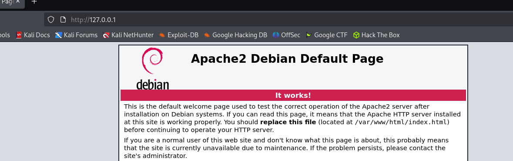
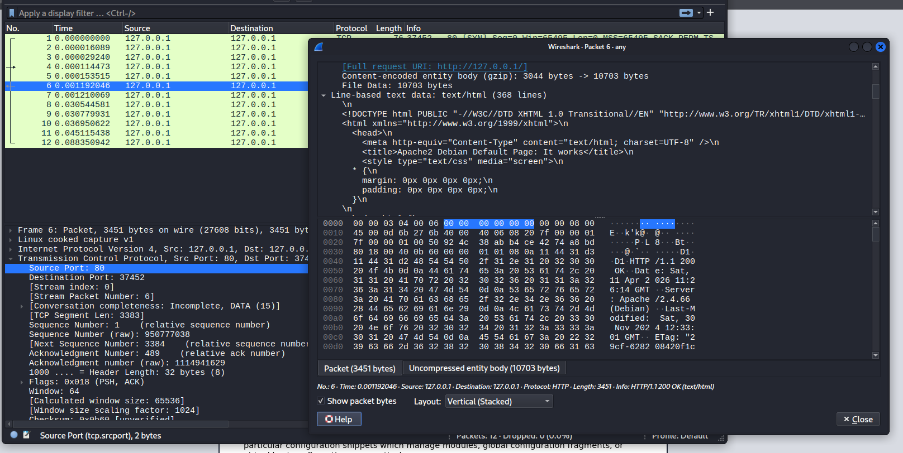
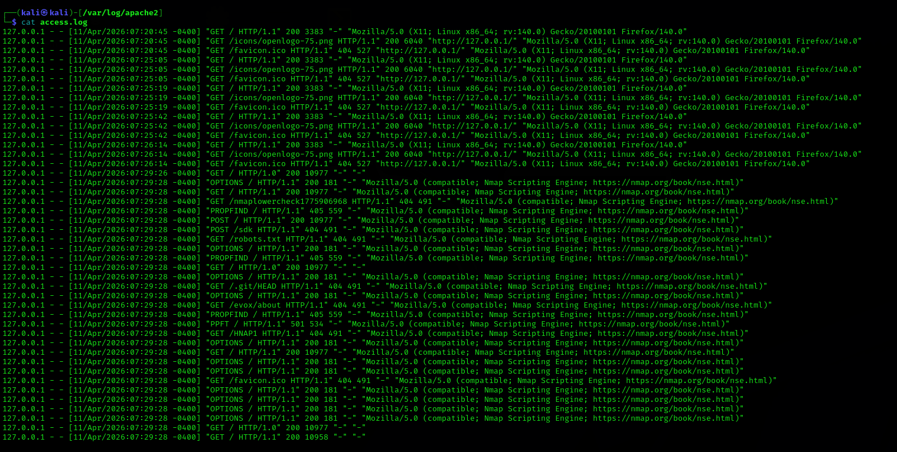
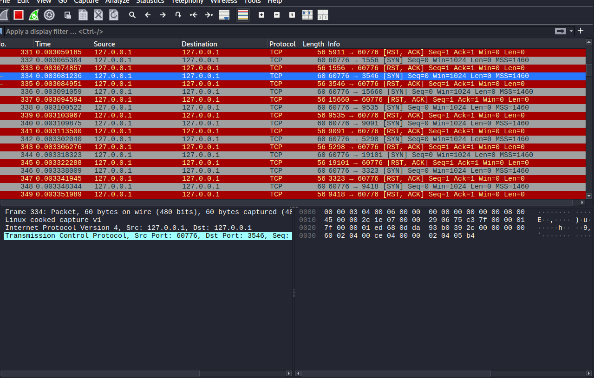
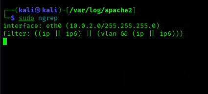

# h2 Lempiväri: violetti
## https://terokarvinen.com/verkkoon-tunkeutuminen-ja-tiedustelu/
> Kaikissa kohdissa edellytetään analyysia ja selitystä. Selvitä ja selitä siis komentojen ja komentoriviparametrien merkitys. Selitä, mitä tulokset tarkoittavat; ja mitä niistä tulisi ymmärtää. Lue vinkit, ennenkuin aloitat.

>x) Lue ja vastaa lyhyesti kysymyksiin. Tässä alakohdassa x ei tällä kertaa tarvitse lukea artikkeleita kokonaan, ei tarvitse tiivistää niitä, eikä tehdä testejä koneella.
>- Selitä tuskan pyramidin idea 1-2 virkkeellä. Bianco 2013: Pyramid of Pain. (Katso eritoten pyramidin kuvaa.)

Tuskan pyramidin näyttää eri aktiiviteettien tasot kuinka pahaa iskua hyökkääjä voi tehdä organisaation tietokoneisiin tms.

Tasoja ovat: Hash:it, ip osoitteet, dns tiedot, organisaation tietoverkko, hyökkäystyökalut, hyökkäyssuunnitelma

>- Selitä timanttimallin (Diamond Model) idea 1-2 virkkeellä. Tekijä esittelee sen aika juhlallisesti, voit myös etsiä yksinkertaisempia artikkeleita hakukoneella tai kelata suoraan timantin kuvaan. Caltagirone et al 2013: Diamond Model

Virginia Nelai:n artikkelin mukaan (https://medium.com/@vnelai01/understanding-the-diamond-model-a-cybersecurity-lens-for-analyzing-intrusions-1127e9b784c9) timanttimalli kertoo miten miten kukin palanen on yhteydessä toisiinsa kyberhyökkäyksessä. Timanttimallin on tehnyt  Sergio Caltagirone, Andrew Pendergast, and Christopher Betz.

>a) Apache log. Asenna Apache-weppipalvelin paikalliselle virtuaalikoneellesi. Surffaa palvelimellesi salaamattomalla HTTP-yhteydellä, http://localhost . Etsi omaa sivulataustasi vastaava lokirivi. Analysoi yksi tällainen lokirivi, eli selitä sen kaikki kohdat. (Jos Apache ei ole kovin tuttu, voit tätä tehtävää varten vain asentaa sen ja testata oletusweppisivulla. Eli ei tarvitse tehdä omia kotisvuja tms.)

Apache asennetaan komennolla "sudo apt update && sudo apt install apache2"

apt update komento päivittää pakettien sourcet, tämä on hyödyllistä ennen jonkun paketin asennusta koska voi olla että kaikki ei ole ajan tasalla eikä asennettavaa pakettia löydy tämän takia. apt upgrade komentoa ei tarvitse suorittaa jos ei jaksa, ellei tule jokin ongelma paketin kanssa. Joskus on kuitenkin hyvä päivittää kaikki komennolla "sudo apt update && sudo apt upgrade".

Sen jälkeen komennolla "systemctl start apache2" käynnistetään weppipalvelin.

Paketti löytyy myös wiresharkista, HTTP yhteys ei ole salattu joten koko paketin saa auki:

>b) Nmapped. Porttiskannaa oma weppipalvelimesi käyttäen localhost-osoitetta ja 'nmap -A' päällä. Selitä tulokset. (Pelkkä http-portti 80/tcp riittää)

Nmap --help löytyi näin:
 -A: Enable OS detection, version detection, script scanning, and traceroute

Eli -A flagilla saa lisää tietoa skannattavasta koneesta

┌──(kali㉿kali)-[~]
└─$ nmap -A 127.0.0.1         
Starting Nmap 7.98 ( https://nmap.org ) at 2026-04-11 07:29 -0400
Nmap scan report for localhost (127.0.0.1)
Host is up (0.000049s latency).
Not shown: 999 closed tcp ports (reset)
PORT   STATE SERVICE VERSION
80/tcp open  http    Apache httpd 2.4.66 ((Debian))
|_http-title: Apache2 Debian Default Page: It works
|_http-server-header: Apache/2.4.66 (Debian)
Device type: general purpose
Running: Linux 5.X|6.X
OS CPE: cpe:/o:linux:linux_kernel:5 cpe:/o:linux:linux_kernel:6
OS details: Linux 5.0 - 6.2
Network Distance: 0 hops

OS and Service detection performed. Please report any incorrect results at https://nmap.org/submit/ .
Nmap done: 1 IP address (1 host up) scanned in 8.18 seconds

Eli siis tuloksista näkee että http server on apache ja mikä versio apachesta. Nmap yrittää myös arvata mikä versio miltä väliltä linuxista.

Unohdin suorittaa roottina. Eli pitäisi käyttää Teron mukaan aina sudo nmap.

>c) Skriptit. Mitkä skriptit olivat automaattisesti päällä, kun käytit "-A" parametria? (Näkyy avoimien porttinumeroiden alta, http-blah, http-blöh...).

OS and service detection, version detection, traceroute

>d) Jäljet lokissa. Etsi weppipalvelimen lokeista jäljet porttiskannauksesta (NSE eli Nmap Scripting Engine -skripteistä skannauksessa). Löydätkö sanan "nmap" isolla tai pienellä? Selitä osumat. Millaisilla hauilla tai säännöillä voisit tunnistaa porttiskannauksen jostain muusta lokista, jos se on niin laaja, että et pysty lukemaan itse kaikkia rivejä?

Tässä logissa näkyy suoraan nmap tekstejä.

>e) Wire sharking. Sieppaa verkkoliikenne porttiskannatessa Wiresharkilla. Huomaa, että localhost käyttää "Loopback adapter" eli "lo". Tallenna pcap. Etsi kohdat, joilla on sana "nmap" ja kommentoi niitä. Jokaisen paketin jokaista kohtaa ei tarvitse analysoida, yleisempi tarkastelu riittää.

En löytänyt nmap sanaa vaikka katsoin paketit silmäillen läpi. Kuitenkin, aika paljon punaista ja harmaata väriä.

syn ja rst,ack

>f) Net grep. Sieppaa verkkoliikenne 'ngrep' komennolla ja näytä kohdat, joissa on sana "nmap".

Ei toiminut. käytin komentoa sudo ngrep ja sudo nmap -A 127.0.0.1

Kokeilin myös sudo nmap 10.0.2.0 mutta silti ei tullut paketteja näkyviin.

>g) Agentti. Vaihda nmap:n user-agent niin, että se näyttää tavalliselta weppiselaimelta.

Chatgpt:n mukaan komennolla
nmap "--script http-title \
--script-args http.useragent="Mozilla/5.0 (Windows NT 10.0; Win64; x64)"

voi vaihtaa nmap user agentin. Tämä ei kuitenkaan toiminut, joten luovutan tämän osalta.

>h) Pienemmät jäljet. Porttiskannaa weppipalvelimesi uudelleen localhost-osoitteella. Tarkastele sekä Apachen lokia että siepattua verkkoliikennettä. Mikä on muuttunut, kun vaihdoit user-agent:n? Löytyykö lokista edelleen tekstijono "nmap"?

En saanut edellistä kohtaa tehtyä, mutta uskon, että ei silloin löydy.

>i) Hieman vaikeampi: LoWeR ChEcK. Poista skritiskannauksesta viimeinenkin "nmap" -teksti. Etsi löytämääsi tekstiä /usr/share/nmap -hakemistosta ja korvaa se toisella. Tee porttiskannaus ja tarkista, että "nmap" ei näy isolla eikä pienellä kirjoitettuna Apachen lokissa eikä siepatussa verkkoliikenteessä. (Tässä tehtävässä voit muokata suoraan lua-skriptejä /usr/share/nmap alta, 'sudoedit'. Muokatun version paketoiminen siis rajataan ulos tehtävästä.)

>j) FCC ID. Etsi valitsemasi langattoman laitteen tiedot FCC ID:llä. Mitä liikenteen purkamista tai manipuloimista hyödyttävää tietoa löydät?

Tunnilla käytiin läpi, että netistä voi siis etsiä langattoman laitteen FCC ID:llä laitteen kytkentäkaavioita, millä taajudella laite lähettää infoa yms. FCC ID ja eri kaaviot yms. on muistaakseni pakollista tehdä ja julkaista jos yritys haluaa myydä laitteitaan EU:n alueella.

>k) Vapaaehtoinen, vaikea: Invisible, invincible. Etsi jokin toinen nmap:n skripti, jonka verkkoliikenteessä esiintyy merkkijono "nmap" isolla tai pienellä. Muuta nmap:n koodia niin, että tuo merkkijono ei enää näy verkkoliikenteessä.
