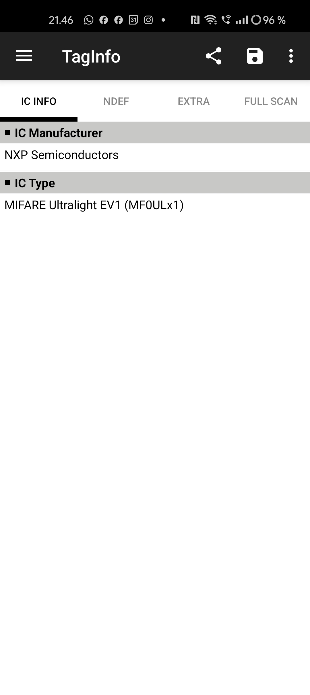
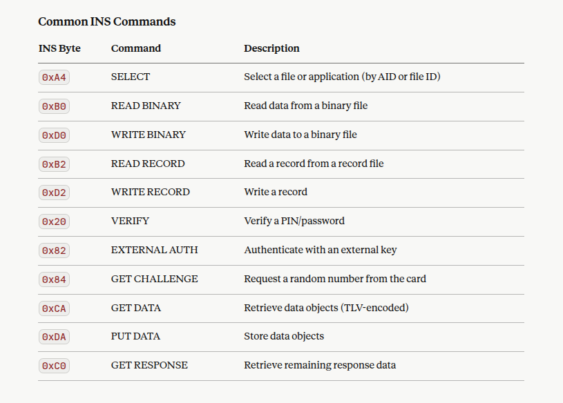
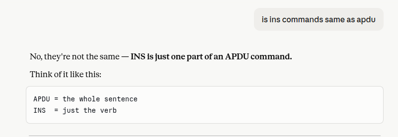

# h4 NFC ja RFID
## Larin tehtävä: https://hhmoodle.haaga-helia.fi/course/view.php?id=45178&section=1#module-3548538

>4. NFC ja RFID
>Luennolla käytetyt työkalut, ohjelmistot  ja materiaalit, sekä kohtitehtävät.

>Luennolle tarvitset Android puhelimen, jossa on RFID/NFC ominaisuudet. (Opettajalla on vain muutama testipuhelin)

>iPhone ei toimi kaikissa tapauksissa.

>Esittely:
>Proxmark3 RDV4
>https://proxmark.com/proxmark-3-hardware/proxmark-3-rdv4
>https://github.com/RfidResearchGroup/proxmark3

>Flipper Zero
>https://flipperzero.one/
>https://github.com/DarkFlippers/unleashed-firmware

>Applikaatiot
>NXP TagInfo https://www.nxp.com/design/design-center/software/rfid-developer-resources/the-nfc-taginfo-app-by-nxp:NFC-TAGINFO
>NFC-Tool https://www.wakdev.com/en/apps.html
>Mifare Classic Tool https://github.com/ikarus23/MifareClassicTool
>NFC Gate https://github.com/nfcgate

>Kortinlukija (Windows, Mac and Linux)
>https://www.verkkokauppa.com/fi/product/504861/Identiv-uTrust-4701-F-Contact-henkilokortinlukija

>Harjoitustehtävä (tunnilla)
>Kortti - NTAG215 https://www.amazon.de/dp/B0CCRG5F7W?ref=ppx_yo2ov_dt_b_fed_asin_title&th=1
>Tapni (backend) https://tapni.com/

>Mielenkiintoista lukemista
>https://bishopfox.com/tools/rfid-hacking-2/attack-tools

>Kotitehtävä:
>1. Tarkastele käytössäsi olevia RFID tuotteita, mieti miten hyvin olet suojautunut RFID urkinnalta?

Käytössä olevat RFID tuotteet:
- pankkikortti
- salikortti

Minulla on paksu lompakko, joka myös samalla estää rfid urkinnan.

Olen lisäksi säätänyt pankkikortilleni ostorajan niin, että se kattaa päivittäiset ostoni. Jos ostokäyttäytymiseni poikkeaa merkittävästi päivittäisestä ostokäyttäytymisestä eli esim. tulee oikein kunnolla shoppailtua, säädän ostorajan korkeammaksi väliaikaisesti.

Salikortissa pitää vaan luottaa siihen että lompakko suojaa. Olen ladannut salikortilleni kertakäyntejä, joten olisi ikävää jos joku kloonaisi kortin ja käyttäisi salikertani :(

Käytimme tunnilla nfc taginfo sovellusta:
https://www.nxp.com/design/design-center/software/rfid-developer-resources/the-nfc-taginfo-app-by-nxp:NFC-TAGINFO

Sovellus näyttää, että kortti olisi MIFARE Ultralight

>2. Tutustu APDU komentojen rakenteeseen (voit käyttää tekoälyä tutustumiseen)

Tekoäly claude sonnet 4.6 mukaan APDU on: "APDU (Application Protocol Data Unit) is the communication unit between a reader and a smart card/NFC device, defined by ISO/IEC 7816-4."

APDU komennot ovat komentoja, joiden avulla voi keskustella nfc tagin kanssa.

Tekoälyn mukaan tässä on yleisimmät apdu komennot:

Tekoälyn mukaan tässä on mahdolliset vastaukset:

Tai siis ins komennot, toisaalta ins on apdun alaluokka tekoälyn mukaan:

>3. Tutki ja kerro minkä mielenkiintoisen RFID hakkerointi uutiset löysit. (Vinkki, useimmat liittyvät henkilökortteihin)

Löysin uutisen liittyen rfid hotellikortteihin:
https://www.convergentds.com/industry-news/hotel-keys-under-hacking-risk-how-convergentds-enhances-rfid-security

uutisessa viitataan toiseen uutiseen:
https://www.wired.com/story/saflok-hotel-lock-unsaflok-hack-technique/

Tätä toista uutista en saa auki koska vain tilaajille, mutta ekassa uutisessa kerrottiin, että turvallisuustutkijat ovat löytäneet haavoittuvuuden saflog brandin rfid lukosta. Sitä käytetään sveitsiläisessä hotellissa. Tiimi kertoo, että 3 miljoonaa huonetta 13 000 hotellissa ovat haavoittuvia.

