# h5 Laboratorio- ja simulaatioympäristöt hyökkäyksissä
## Larin tehtävä: https://hhmoodle.haaga-helia.fi/course/view.php?id=45178&section=1#module-3548540

>Luennolla käytetyt työkalut, ohjelmistot  ja materiaalit, sekä kohtitehtävät.

>Lataathan mininet virtuaalikoneen ennen luentoa ja pyrit saaman sen käyntiin.

>VMWare Fusion and Workstation https://www.vmware.com/products/desktop-hypervisor/workstation-and-fusion

>### h5 kotitehtävät 

>a) Aja tunnilla esitetty ARP hyökkäys ja tutki, miten se toimii.

ladataan labs.tar.gz
https://hhmoodle.haaga-helia.fi/mod/resource/view.php?id=3548543
(moodle tunnukset vaaditaan lataamiseen)

mkdir labs && cd labs/

cp ../labs.tar.gz .

tar -xzf labs.tar.gz

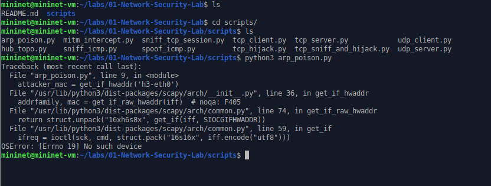

ei toiminut.

Modataan vähän:

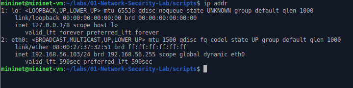

Eli siis muokkasin attacker mac muuttujan eth0, se oli väärin aiemmin.

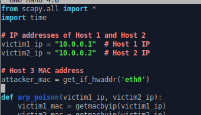

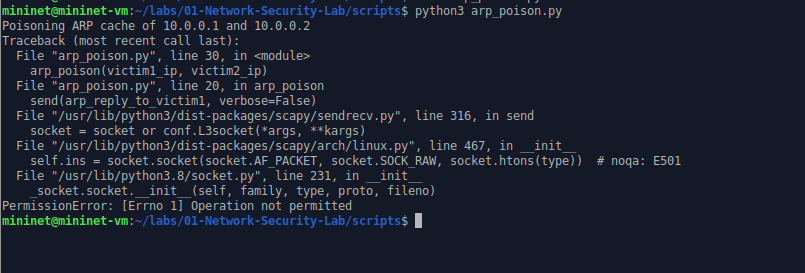

Vieläkin tulee erroria.

operation not permitted. Sudo käyttöön.

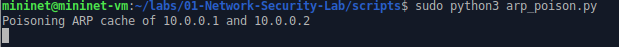

Toimii!

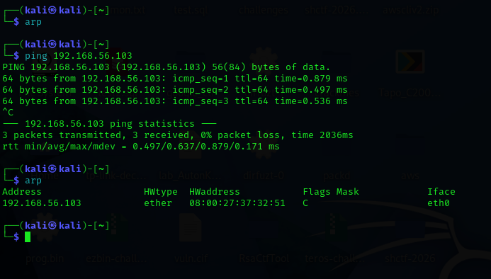

Kuvasta näkee että arp välimuisti on tyhjä. Ajetaan ping. Arpista löytyi sen jälkeen uusi rivi.

Mun koneen ip virtualboxin verkkokortilla on:

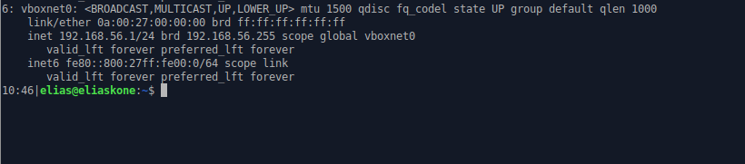

Setup:
- Mun oma kone (host) 192.168.56.1
- kali linux (vm) 192.168.56.101
- mininet (vm) 192.168.56.103
- virtualbox dhcp server 192.168.56.100 (not in scope)

Pingataan tätä mun konetta kalista ja katsotaan arp:

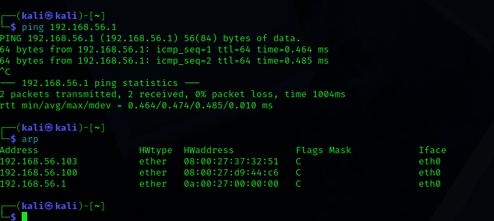

Muokataan script $nano arp_poison.py:

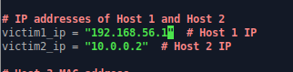

pidetään victim2_ip ennallaan, sitä ei tarvita. Voisi kommentoidakin pois, mutta en viitsi ettei script mene rikki.

Ajetaan script:

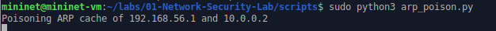

Kokeillaan ping 192.168.56.1 ip:tä, kuten huomataan ping menee läpi. ja lisäksi arp säilyy ennallaan.

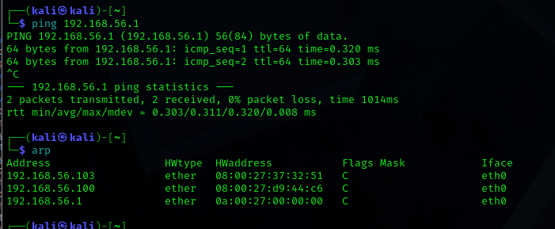

Käynnistetään kali uudelleen. Kuten huomataan, arp muisti on nollautunut.

Varmasti on nopeampiakin tapoja tehdä tämä arp muistin nollaus.

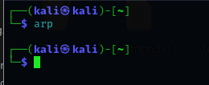

Ei toiminut...
Laitoin tänne nyt molemmat ip:t:

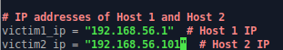

(tässä koko script)

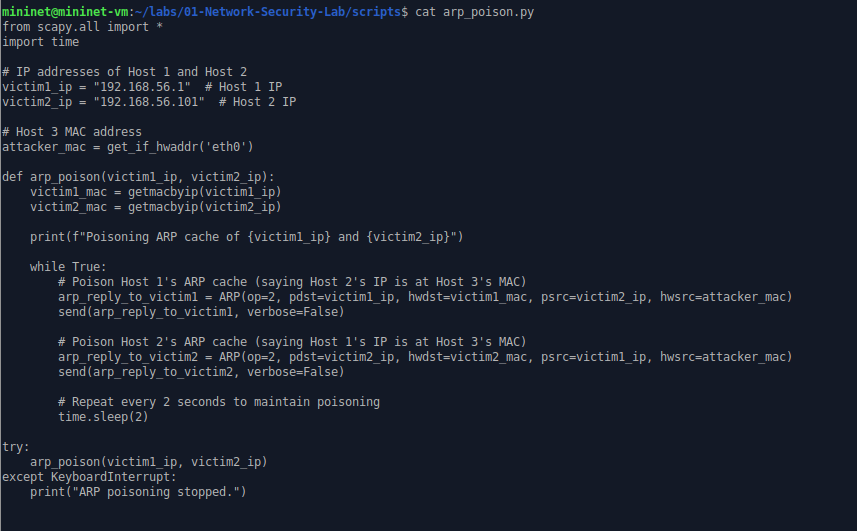

Kokeillaan uudelleen

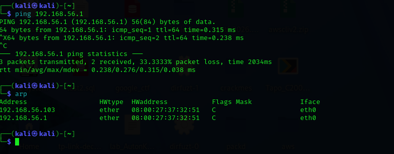

Kuten huomataan, mac osoite on eri. Mac osoittella on 2 ip:tä

Testataan vielä ssh yhteyttä:

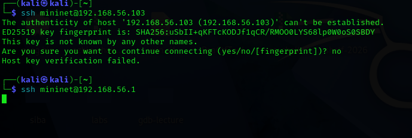

192.168.56.103 toimii, 192.168.56.1 ei toimi. En tiedä miksi ei toimi.

Pakettien pitäisi kuitenkin mennä mininetiin, koska arp on poisonattu.

>b) Samassa hakemistossa on myös ICMP Spoofing ja TCP Session Hijacking. Aja molemmat labrat läpi ja kerro, miten molemmat tekniikat toimivat.
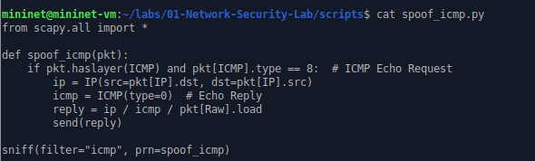

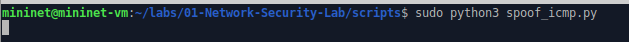

Pingataan hostissa:

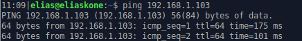

Ei toiminut. Kokeillaan kali vm pingata:

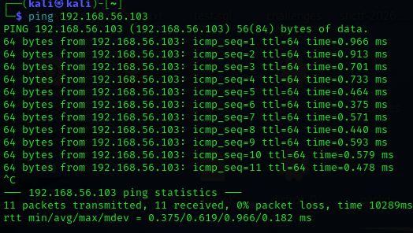

Toimii!:

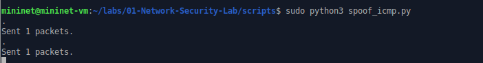

Eli siis jos oikein ymmärsin niin tällä scriptillä pystyy kuuntelemaan sitä jos joku pingaa konetta.

Tekoäly geminin mukaan ICMP spoof tarkoittaa tätä:

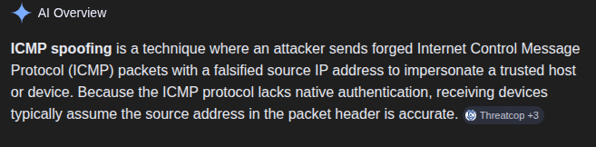

Eli siis pystyn yhdistämään arp poison ja icmp spoof jutun tämän avulla.

TCP Session hijacking:

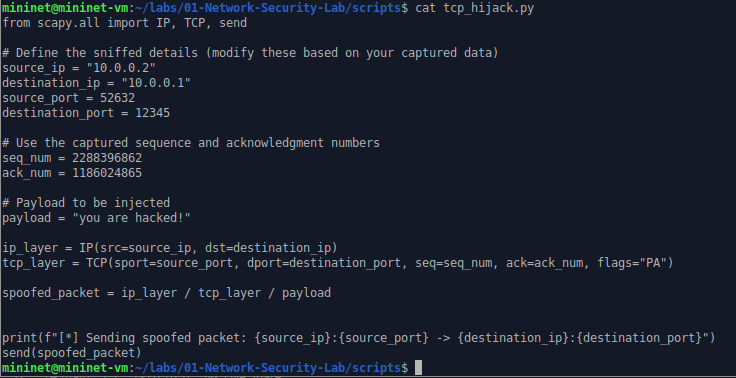

Ymmärsin itse skriptin lukemisen jälkeen, että voin skriptin avulla lähettää omia paketteja kahden koneen (server & client) yhteyden väliin. Ja server luulisi, että liikenne tulee clientiltä vaikka todellisuudessa tulee hyökkääjän laitteelta (mininet). Toisaalta HTTPS eli suojatussa http yhteydessä tämä ei toimi.

>c) Hakemistossa 02-SDN-DDos_Simulation tryout-kansiossa on työkalut, jotta voit ajaa TCP SYN-Flood-hyökkäyksen turvallisesti.
>- Kirjoita, miten ajoit hyökkäyksen ja miten kyseinen hyökkäys toimii.

Ymmärsin, että harjoituksessa yritetään tehdä palvelunestohyökkäys.

Ajoin main.py. Pitää asentaa numpy.

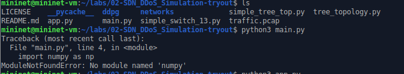

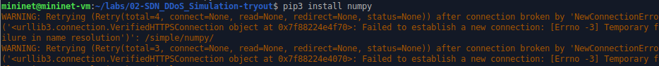

Sallin yhteyden väliaikasesti internettiin numpyn asentamista varten.

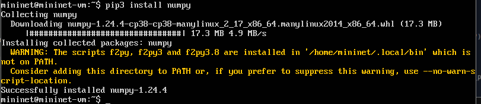

Varmistetaan että netti on taas pois:

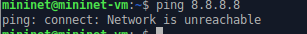

Lisää asennettavaa:

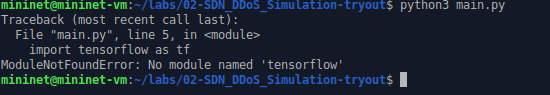

Netti taas päälle.

Muisti loppui kesken asennuksen aikana:

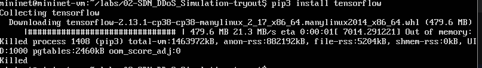

Lisätään ram muistia vm ja yritetään uudelleen.

Kovalevyn tila loppui kesken:

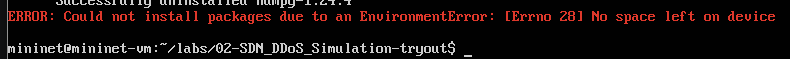

Eli siis pitäisi sitten suurentaa kovalevyn tilaa. Jätin tehtävän tekemisen tälläkertaa tähän, aika loppui kesken. Lisäksi kuulemma kaikki ohjelmat olisivat pitäneet olla valmiina asennettuna vm mutta ei ollut.

Miten tästä eteenpäin TODO:
- Suurenna virtuaalikoneen kovalevyn tilaa
- Partitioi levy uudelleen, eli siis pitäisi kasvattaa kovalevyn linux partitio kattamaan myös vapaa tila kovalevyllä

>d) Vapaaehtoinen tutustu myös seuraaviin työkaluihin
>- https://evilginx.com/
>- https://github.com/utoni/ptunnel-ng

>Kerro kyseisistä työkaluista, mitä ne tekevät, saitko asennettua ne, lisää ohjeraporttiin ja olivatko kyseiset työkalut mielenkiintoisia, jos olivat, niin miksi? Pohdi raportissasi, mihin ja missä tilanteissä kyseisiä työkaluja voidaan käyttää? Arvioi, onko käyttö kohde moraalisesti oikein tai väärin.