# h7 Aaltoja harjaamassa
## Tehtävä h7: https://terokarvinen.com/verkkoon-tunkeutuminen-ja-tiedustelu/#laksyt
> Lapsena softaradiot olivat tieteisfiktiota. Sitten salaisia projekteja. Sitten kalliita. Ja nyt käytössämme alkaen 25 EUR.
> Tässä harjoituksessa analysoit siepattuja signaaleja sekä automaattisesti että hieman myös käsin.
> Lue myös vinkit ennen kuin aloitat käytännön harjoitukset.

>x) Lue ja tiivistä. (Tässä x-alakohdassa ei tarvitse tehdä testejä tietokoneella, vain lukeminen tai kuunteleminen ja tiivistelmä riittää. Tiivistämiseen riittää muutama ranskalainen viiva.)
>- Hubacek 2019: Universal Radio Hacker SDR Tutorial on 433 MHz radio plugs https://youtu.be/sbqMqb6FVMY?t=199 (Video, alkaen 3:19 ja päättyen 7:40. Yhteensä noin 4 min.)

- Videossa näytetään, miten kaapattua signaalia voi analysoida
- Sovelluksesta voi muuttaa signaalin bitti arvoiksi (1 ja 0)

>- Cornelius 2022: Decode 433.92 MHz weather station data https://www.onetransistor.eu/2022/01/decode-433mhz-ask-signal.html

- Cornelius kertoo, että hänellä on oma sääasema. Sisällä on näyttö ja ulkona on sensori. 2 laitetta kommunikoi toistensa kanssa tietyllä taajuudella.
- Cornelius kertoo, miten hän analysoi signaalidataa ja sai lähetettyä omia signaaleja sisätilan näytölleen.

>- Vapaaehtoinen, vaikeahko: Lohner 2019: Decoding ASK/OOK_PPM Signals with URH and rtl_433 https://github.karllohner.com/SDR/Decoding/Example_2019-01-24/

>a) Lähteet ja läppä. Tarkista, että jokaisessa kotitehtäväraportissasi on viitattu lähteisiin (kurssiin, tehtäviin, kirjoihin, ohjeisiin...). Tarkista myös, että tekoälyn käyttö on kerrottu läpikyvästi ja merkitty lähteisiin. Laita läppäri valmiiksi lipunryöstöön. Opettaja voi tarkistaa läppärin. Jos käytät lipunryöstössä pelkästään virtuaalikonetta (myös weppiselailun), tarkastan vain virtuaalikoneen. Tätä alakohtaa a ei tarvitse raportoida, pelkkä kuittaus tekemisestä riittää.

Ok!

>b) rtl_433. Asenna rtl_433 automaattista analyysia varten. Kokeile, että voit ajaa sitä. './rtl_433' vastaa "rtl_433 version 25.02 branch..."

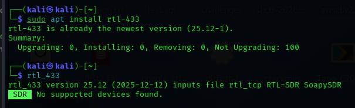

>c) Automaattinen analyysi. Mitä tässä näytteessä tapahtuu? Mitä tunnisteita (id yms) löydät? Converted_433.92M_2000k.cs8 (https://terokarvinen.com/2025/verkkoon-tunkeutuminen-ja-tiedustelu--ici013as3a-3001--2025p4/samples/Converted_433.92M_2000k.cs8). Analysoi näyte 'rtl_433' ohjelmalla.

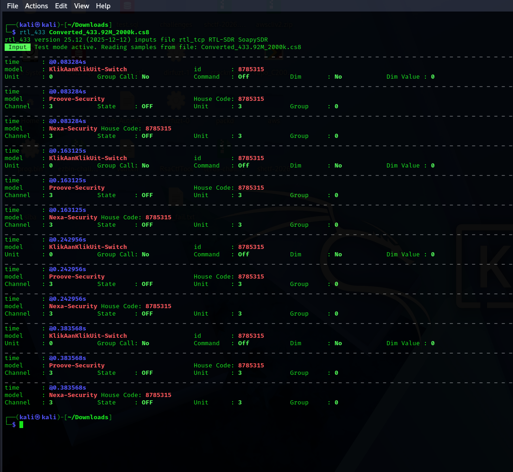

Näytteestä huomataan, että aika (time      : @0.083284s) on kaikissa hetkissä sama. Nämä ovat luultavasti arvauksia mahdollisista laitteista:
- KlikAanKlikUit-Switch
- Proove-Security
- Nexa-Security

Kirjoitin nettiin arvaukset

https://community.home-assistant.io/t/433mhz-remote-control-with-rtl-sdr-and-rt-433-and-rtl-433-mqtt-auto-discovery/397131

Vaikuttaa, että laite olisi tälläinen (etenkin, kun käytimme tätä tunnilla):

Photo copyright: Bluecloud

Gemini tekoälykin sanoo samaa:

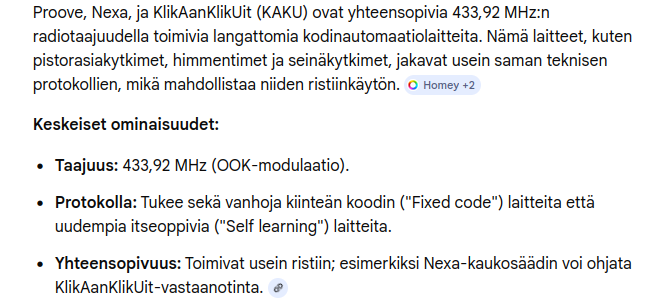

Näytteestä löyty id:

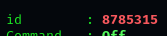

Muita tunnisteita (state, unit, dim, dim value, group):

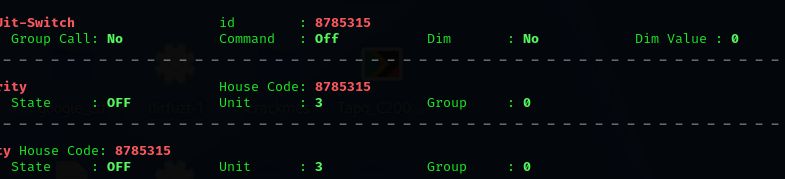

Luulisin, että kuvassa olevan langattoman kaukosäätimen nappia ollaan painettu (viime tunnillakin tehtiin tätä, näytteet näyttivät muistaakseni samoilta)

>d) Too compex 16? Olet nauhoittanut näytteen 'urh' -ohjelmalla .complex16s-muodossa. Muunna näyte rtl_433-yhteensopivaan muotoon ja analysoi se. Näyte Recorded-HackRF-20250411_183354-433_92MHz-2MSps-2MHz.complex16s (https://terokarvinen.com/2025/verkkoon-tunkeutuminen-ja-tiedustelu--ici013as3a-3001--2025p4/samples/Recorded-HackRF-20250411_183354-433_92MHz-2MSps-2MHz.complex16s)

Tiedosto ei avautunut suoraan:

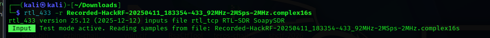

Vaikea tehtävä, katsoin vinkkiä Tero Karvisen kotiläksysivulta:

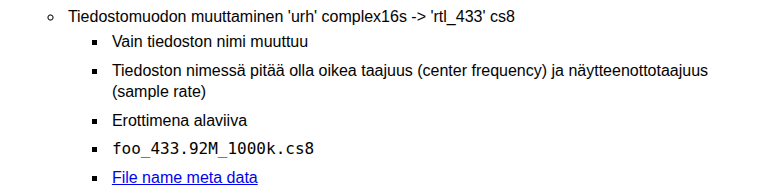

Kopioitiin tiedosto uudella nimellä:

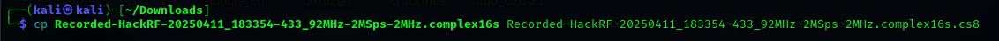

Aukesi!:

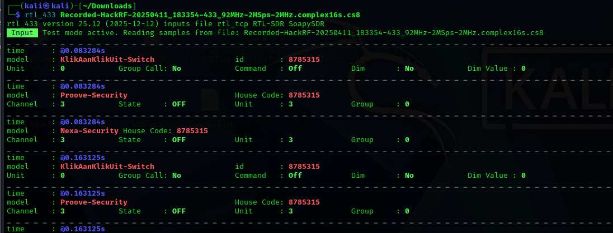

>e) Ultimate. Asenna URH, the Ultimate Radio Hacker.

Asennetaan URH

URH github sivuilla (https://github.com/jopohl/urh) kerrotaan asennusohjeet:

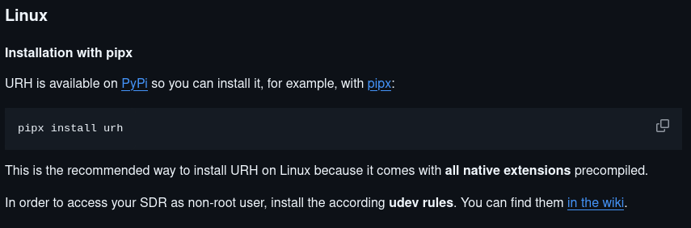

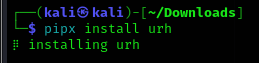

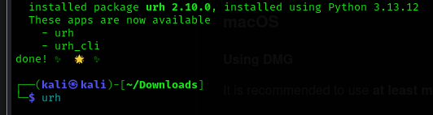

Seuraavaksi piti valita tiedosto

>- Tarkastele näytettä 1-on-on-on-HackRF-20250412_113805-433_912MHz-2MSps-2MHz.complex16s. (https://terokarvinen.com/2025/verkkoon-tunkeutuminen-ja-tiedustelu--ici013as3a-3001--2025p4/samples/1-on-on-on-HackRF-20250412_113805-433_912MHz-2MSps-2MHz.complex16s) Siinä Nexan pistorasian kaukosäätimen valon 1 ON -nappia on painettu kolmesti. Käytä Ultimate Radio Hacker 'urh' -ohjelmaa.

Ladataan tiedosto ja avataan se URH ohjelmassa:

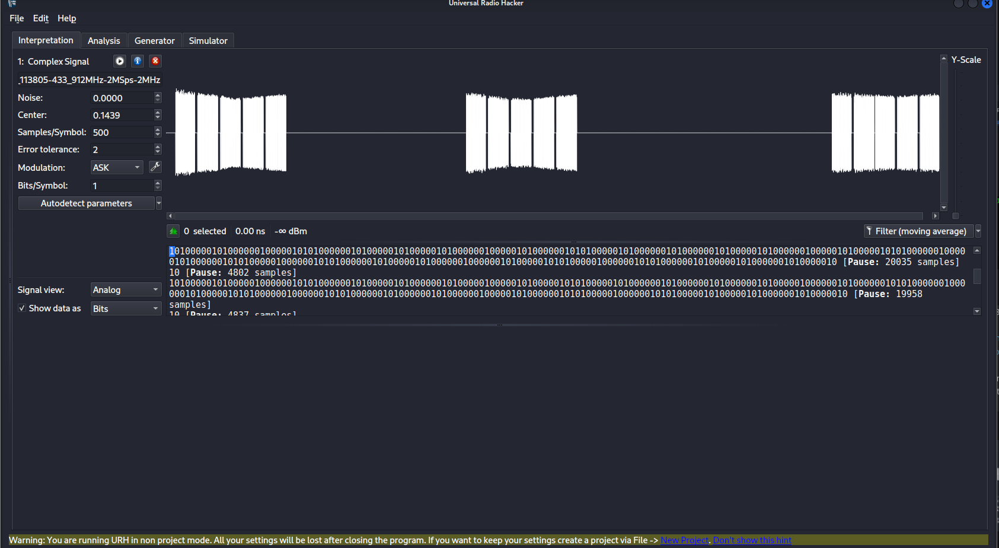

>f) Yleiskuva. Kuvaile näytettä yleisesti: kuinka pitkä, millä taajuudella, milloin nauhoitettu? Miltä näyte silmämääräisesti näyttää?

Valitsin koko näytteeen (klikkasin hiirellä näytteestä ja sen jälkeen ctrl + a):

Näyteen alapuolelta saadaan tietoja:

Näytteen pituus: 5.49 sekuntia

Yksi napinpainallus kestää noin sekunnin (valitsin hiirellä suunilleen yksittäisen painalluksen):

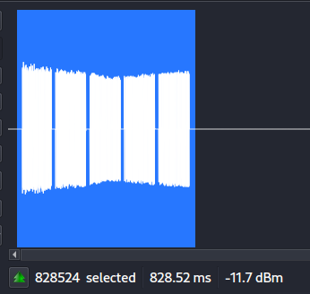

Katsoin apua toisen opiskelijan työstä: https://github.com/nurminenkasper/Verkkoon-tunkeutuminen-ja-tiedustelu/blob/main/h3/h3-Aaltoja-harjaamassa.md

Eli siis toisen opiskelijan mukaan pitää painaa info ja sieltä saadaan lisää tietoa:

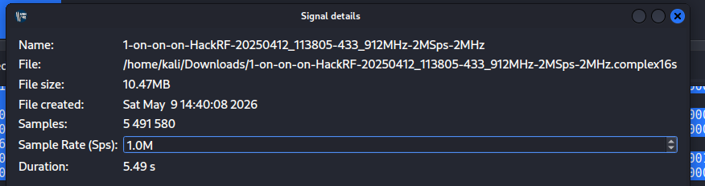

Näytteenottotaajuus: 1.0M
File Created: tästä voi päätellä nauhoitusajankohdan

Kysyin myös tekoäly claudelta apua:

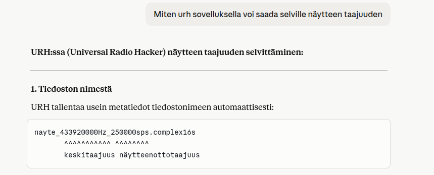

Tiedoston nimestä voi myös päätellä jotakin.

Signal details kuvassa eli siis infonäkymä jota näytin tossa, niin siellä näkyy tiedoston nimi.

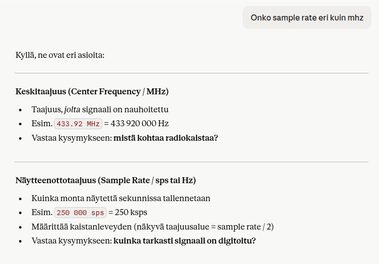

Yritin selvittää keskitaajuutta.

Päättelen tiedoston nimestä, arvaan että signaalin keskitaajuus olisi 433.912MHz.

>g) Bittistä. Demoduloi signaali niin, että saat raakabittejä. Mikä on oikea modulaatio? Miten pitkä yksi raakabitti on ajassa? Kuvaile tätä aikaa vertaamalla sitä johonkin. (Monissa singaaleissa on line encoding, eli lopullisia bittejä varten näitä "raakabittejä" on vielä käsiteltävä)

En oikein ymmärtänyt tehtävää, mitä siinä pitäisi tehdä. Jätän tekemättä, koska pohdiskelun jälkeen en tiedä mitä vastausta haettiin.

Tässä näkymässä joitakin bittejä, mutta en usko että olisi oikea vastaus:

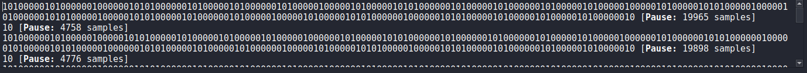

Katsoin vastauksen toisen opiskelijan työstä, mutta en ymmärtänyt sitä:

https://github.com/nurminenkasper/Verkkoon-tunkeutuminen-ja-tiedustelu/blob/main/h3/h3-Aaltoja-harjaamassa.md

>h) Vapaaehtoinen: Sdr++. Kokeile sdr++ -sovellusta ja esittele sillä jokin "hei maailma" -tyyppinen esimerkki.

>i) Vapaaehtoinen, vaikeahko: GNU Radio. Asenne GNU Radio ja tee sillä yksinkertainen "Hei maailma".

## Lähteet:
### Omat lähteet

https://www.onetransistor.eu/2022/01/decode-433mhz-ask-signal.html

https://community.home-assistant.io/t/433mhz-remote-control-with-rtl-sdr-and-rt-433-and-rtl-433-mqtt-auto-discovery/397131

https://github.com/jopohl/urh

https://github.com/nurminenkasper/Verkkoon-tunkeutuminen-ja-tiedustelu/blob/main/h3/h3-Aaltoja-harjaamassa.md

### Tehtävänannossa kohdassa x) tiivistä mukana oleva linkki:

https://youtu.be/sbqMqb6FVMY?t=199

### Näytteet:

https://terokarvinen.com/2025/verkkoon-tunkeutuminen-ja-tiedustelu--ici013as3a-3001--2025p4/samples/Converted_433.92M_2000k.cs8

https://terokarvinen.com/2025/verkkoon-tunkeutuminen-ja-tiedustelu--ici013as3a-3001--2025p4/samples/Recorded-HackRF-20250411_183354-433_92MHz-2MSps-2MHz.complex16s

https://terokarvinen.com/2025/verkkoon-tunkeutuminen-ja-tiedustelu--ici013as3a-3001--2025p4/samples/1-on-on-on-HackRF-20250412_113805-433_912MHz-2MSps-2MHz.complex16s